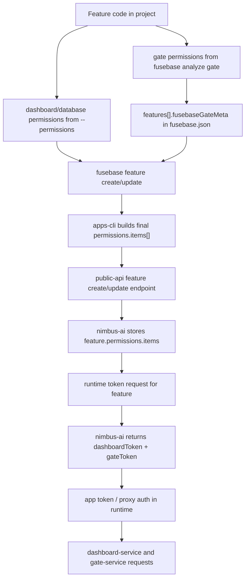

# Feature Permissions

This document is the central reference for how feature permissions work in `apps-cli`.

It covers:

- permission types supported by the CLI
- where permissions are stored
- the end-to-end workflow from local code to runtime tokens
- how `fusebase analyze gate` and `feature update` interact
- what gets sent to `public-api`

For the low-level Gate snapshot format in `fusebase.json`, see [FUSEBASE_GATE_META.md](FUSEBASE_GATE_META.md).

## Source of truth

There are two different stores:

1. **Remote feature permissions**  
   Canonical runtime permissions live on the platform in the feature record (`feature.permissions.items`).

2. **Local Gate analysis snapshot**  
   The CLI stores Gate SDK analysis results in `fusebase.json` under the specific feature:

```json
{
  "features": [
    {
      "id": "feature-id",
      "path": "features/my-feature",
      "fusebaseGateMeta": {
        "usedOps": ["listTokens"],
        "permissions": ["token.read"]
      }
    }
  ]
}
```

`fusebaseGateMeta` is **not** the canonical permission store for the feature. It is only the local Gate analysis snapshot used to help build the next `feature update` request.

## End-to-end workflow

This is the full permissions path across `apps-cli`, `public-api`, `nimbus-ai`, and runtime:



### What each layer owns

- `apps-cli`
  - parses manual `dashboardView/database` permissions
  - analyzes Gate SDK usage and stores local `fusebaseGateMeta`
  - fetches the current remote feature during `feature update`
  - builds one final `permissions.items[]` payload
- `public-api`
  - accepts the mixed permission payload
  - forwards it to `nimbus-ai`
- `nimbus-ai`
  - validates and stores `feature.permissions.items`
  - later uses them to generate `dashboardToken` and `gateToken`
- runtime (`app-wrapper` / proxies)
  - requests a token for the feature
  - forwards downstream bearer tokens to `dashboard-service` and `gate-service`

## Typical lifecycle

### 1. Create a feature

Typical sequence for a new feature:

1. `fusebase feature create ...`
2. add app code
3. if the app uses Gate SDK, run `fusebase analyze gate --feature <featureId>`
4. push permissions with `fusebase feature update <featureId> --permissions="..." --sync-gate-permissions`

At creation time, the feature may still have no permissions. That is normal. The canonical permission state appears only after create/update requests reach the platform.

### 2. Add or change dashboard/database access

If only resource permissions changed:

1. edit the manual `--permissions` DSL
2. run `fusebase feature update <featureId> --permissions="..."`
3. CLI keeps current remote `gate` permissions unchanged

### 3. Add or change Gate SDK calls

If only Gate usage changed:

1. edit feature code
2. run `fusebase feature update <featureId> --sync-gate-permissions`
3. CLI analyzes the feature path, updates local `fusebaseGateMeta`, keeps current remote `dashboardView/database`, and replaces remote `gate`

### 4. Change both in one pass

If both resource access and Gate usage changed:

1. edit feature code
2. run `fusebase feature update <featureId> --permissions="..." --sync-gate-permissions`
3. CLI sends one full mixed replacement payload

## Runtime path

After permissions are stored on the platform, runtime uses them indirectly through feature token generation:

1. runtime requests a token for a specific feature
2. `nimbus-ai` reads stored `feature.permissions.items`
3. `nimbus-ai` builds downstream service tokens from those permissions
4. runtime uses those service tokens when proxying calls to downstream services

Current downstream mapping:

- `dashboardView` / `database` contribute to `dashboardToken`
- `gate` contributes to `gateToken`

The important consequence is:

- `fusebase.json` is only local analysis state
- runtime permissions come only from the remote feature record
- `feature update` is the step that turns local intent into runtime behavior
- `deploy` publishes code only; it does not publish permissions

## Deploy and publish

`fusebase deploy` and `fusebase feature update` do different jobs:

- `fusebase feature update ...` updates the remote feature record, including `permissions.items`
- `fusebase deploy` uploads files and creates a new feature version

That means a feature can be deployed successfully while still having:

```json
{
  "permissions": {
    "items": []
  }
}
```

In that state:

- the page may still load
- local development may still appear to work
- runtime access is not correctly published yet for dashboard/gate-backed features

For release-ready behavior:

1. sync permissions with `feature update`
2. then deploy code with `fusebase deploy`

If the feature uses Gate SDK at runtime, `fusebase feature update <featureId> --sync-gate-permissions` is required before the feature should be considered fully published.

## Permission types

The CLI understands three permission item types:

- `dashboardView`
- `database`
- `gate`

### `dashboardView`

Manual DSL:

```bash
dashboardView.<dashboardId>:<viewId>.read
dashboardView.<dashboardId>:<viewId>.read,write
```

API shape:

```json
{
  "type": "dashboardView",
  "resource": {
    "dashboardId": "dash_123",
    "viewId": "view_456"
  },
  "privileges": ["read", "write"]
}
```

### `database`

Manual DSL:

```bash
database.id:<databaseId>.read
database.alias:<databaseAlias>.read,write
```

API shape:

```json
{
  "type": "database",
  "resource": {
    "databaseId": "db_123"
  },
  "privileges": ["read"]
}
```

or

```json
{
  "type": "database",
  "resource": {
    "databaseAlias": "customers"
  },
  "privileges": ["read", "write"]
}
```

### `gate`

`gate` permissions are not entered through the `--permissions` DSL today.

They are derived from Gate SDK usage analysis:

1. `fusebase analyze gate`
2. CLI resolves used operation ids into permission strings via `POST /v1/gate/resolve-operation-permissions`
3. resolved strings are written into `features[].fusebaseGateMeta.permissions`

When synced to the feature, the CLI sends them as:

```json
{
  "type": "gate",
  "privileges": ["org.members.read", "token.write"]
}
```

## Commands

## `fusebase analyze gate`

Purpose:

- scans a feature path for Gate SDK API calls
- writes `usedOps` and resolved `permissions` into `features[].fusebaseGateMeta`

Current behavior:

- `--feature <featureId>` analyzes one feature
- without `--feature`, the CLI analyzes all configured features with `path`
- analysis is scoped to `feature.path`

This command only updates local `fusebase.json`. It does **not** update remote feature permissions by itself.

## `fusebase feature update <featureId>`

This is the command that pushes permissions to the platform.

It supports three independent inputs:

- `--access`
- `--permissions`
- `--sync-gate-permissions`

### `--permissions`

`--permissions` updates only the manual resource permissions:

- `dashboardView`
- `database`

If `--sync-gate-permissions` is not passed, existing remote `gate` permissions are preserved.

### `--sync-gate-permissions`

`--sync-gate-permissions` does all of this for the current feature:

1. runs Gate analysis for `feature.path`
2. updates `features[].fusebaseGateMeta`
3. resolves Gate operations into permission strings
4. replaces remote `gate` permissions with the analyzed set

If no Gate SDK calls remain in the feature, the synced `gate` set becomes empty, so remote `gate` permissions are cleared.

If `--permissions` is not passed, existing remote `dashboardView/database` permissions are preserved.

### Final request shape

The backend receives one final replacement payload.

The CLI fetches the current remote feature, replaces only the parts affected by flags, and sends one full `permissions.items[]` array.

That means:

- the backend does not need merge logic
- add/remove flows work through normal full replacement

### Behavior matrix

| Command | Result |
|--------|--------|
| `feature update <id> --permissions="..."` | Replace `dashboardView/database`, keep current remote `gate` |
| `feature update <id> --sync-gate-permissions` | Replace `gate`, keep current remote `dashboardView/database` |
| `feature update <id> --permissions="..." --sync-gate-permissions` | Replace both sections in one request |
| `feature update <id> --access="..."` | Change access only; permissions untouched |
| `feature update <id> --access="..." --sync-gate-permissions` | Change access and replace `gate` |

## `fusebase feature create`

`feature create` can send manual `--permissions` during creation.

For Gate permissions, the usual flow for a brand-new feature is:

1. `fusebase feature create ...`
2. add Gate SDK code
3. `fusebase feature update <featureId> --sync-gate-permissions`

If a local feature entry with the same `path` already exists and already has `fusebaseGateMeta.permissions`, the create flow may include those `gate` permissions too. But the normal and explicit sync flow is `feature update --sync-gate-permissions`.

## Full example

Example project config:

```json
{
  "features": [
    {
      "id": "ylmqefvwpewz4cwm",
      "path": "features/gate-demo",
      "dev": {
        "command": "npm run dev"
      },
      "build": {
        "command": "npm run build",
        "outputDir": "dist"
      }
    }
  ]
}
```

Example lifecycle:

1. Developer adds dashboard usage and Gate SDK calls under `features/gate-demo`
2. Developer runs:

```bash
fusebase feature update ylmqefvwpewz4cwm \
  --permissions="dashboardView.dash_1:view_1.read;database.alias:customers.read" \
  --sync-gate-permissions
```

3. CLI:
   - reads the current remote feature
   - analyzes `features/gate-demo`
   - updates `features[].fusebaseGateMeta`
   - builds one mixed `permissions.items[]` array
   - sends one `PATCH` request
4. `public-api` forwards the request to `nimbus-ai`
5. `nimbus-ai` stores the new permissions on the feature
6. at runtime, feature token generation uses those stored permissions to issue downstream service tokens

## Examples

Update only resource permissions:

```bash
fusebase feature update feat_123 \
  --permissions="dashboardView.dash_1:view_1.read;database.alias:customers.write"
```

Sync only Gate permissions:

```bash
fusebase feature update feat_123 --sync-gate-permissions
```

Update both resource permissions and Gate permissions in one request:

```bash
fusebase feature update feat_123 \
  --permissions="dashboardView.dash_1:view_1.read,write;database.id:db_1.read" \
  --sync-gate-permissions
```

## Related files

- `lib/permissions.ts` — parse manual DSL and build final permission payloads
- `lib/commands/feature-update.ts` — `feature update` behavior
- `lib/commands/feature-create.ts` — `feature create` behavior
- `lib/commands/analyze.ts` — CLI entrypoint for Gate analysis
- `lib/gate-sdk-analyze.ts` — shared Gate analysis + resolve helper
- `lib/config.ts` — `fusebaseGateMeta` read/write logic
