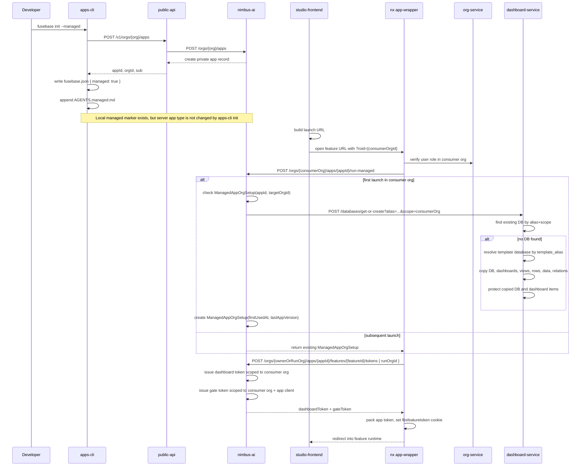
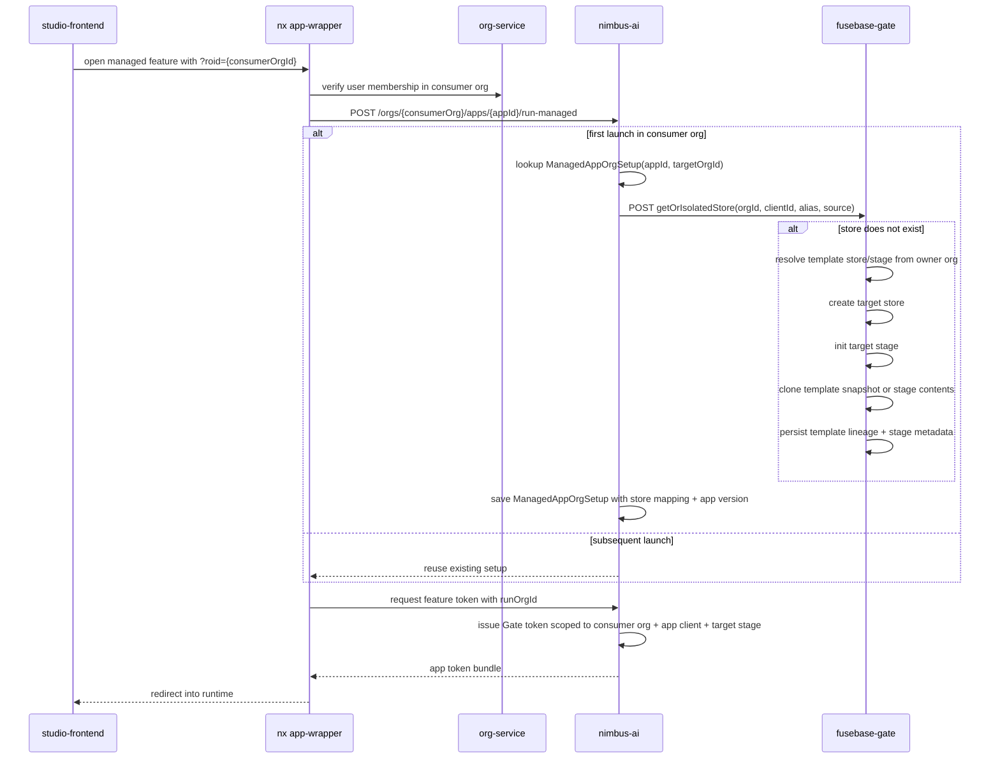

# Managed Apps: End-to-End Flow

## Scope

This document describes the current managed app flow across these parts of the system:

- `apps-cli`: local project bootstrap and managed-specific local markers
- `studio-frontend` / `nx-frontend app-wrapper`: launch and runtime bootstrap
- `nimbus-ai`: managed app discovery, first-run setup, and token issuance
- `dashboard-service`: per-org database creation by template copy
- `fusebase-gate`: isolated store registry, stage databases, migrations, checkpoints, and runtime CRUD for `sql/postgres`

It also calls out important implementation gaps visible in the current code.

## Short Version

A managed app is a platform app whose runtime can be launched in a consumer org, while its app definition may live in a different owner org.

The actual per-org data isolation is achieved by:

1. Launching the feature with `roid=<targetOrgId>`
2. Calling `run-managed` in `nimbus-ai` on first launch for that target org
3. Creating or reusing a target-org database in `dashboard-service` via `getOrCreateDatabase`
4. Copying a template database by alias into the target org
5. Issuing runtime tokens with `runOrgId`, so dashboard/gate permissions are scoped to the consumer org

## Actors

- Developer: initializes the local project with `apps-cli`
- App owner org: the org that owns the app record and feature records
- Consumer org: the org where the managed app is actually launched
- `app-wrapper`: runtime bootstrap layer that validates access, runs setup, and issues cookies/tokens
- `nimbus-ai`: source of truth for apps, features, managed setup records, and downstream token issuance
- `dashboard-service`: source of truth for copied databases/dashboards/views/rows/relations
- `fusebase-gate`: source of truth for isolated stores, stage instances, migration status, and restore/checkpoint mechanics

## High-Level Flow

## 1. What `apps-cli --managed` Actually Does

`apps-cli` has a hidden `init --managed` flag. In the current implementation it does three managed-specific things:

- writes `"managed": true` into local `fusebase.json`
- appends `apps-cli/managed-template/AGENTS.managed.md` into local `AGENTS.md`
- uses the managed marker only for local guidance and optional GitLab tagging

The managed appendix tells feature authors to:

- never hardcode dashboard/database/view UUIDs
- use aliases instead
- resolve aliases at runtime via `resolveAliases`

Important: `apps-cli` still creates the app with the normal public API call `POST /v1/orgs/{org}/apps`, and that API path only sends `title` and optional `sub`.

Observed consequence:

- `fusebase init --managed` does not, by itself, promote the server-side app record to `type=managed`
- actual managed behavior in `nimbus-ai` depends on the app record already being `AppType.Managed`

## 2. How Managed Apps Become Discoverable

In `nimbus-ai`, `getApps(orgId)` is intentionally asymmetric:

- private apps are loaded only from the current org
- managed apps are loaded from all orgs

This is why a consumer org can see a managed app that belongs to another org.

Feature listing follows the same idea:

- when the app is managed, `nimbus-ai` can serve feature metadata without normal org ownership checks

## 3. Launch Path in Frontend Runtime

Managed launch behavior is driven by `roid`, the target org id.

Flow:

1. `studio-frontend` builds the launch URL
2. if the app is managed, it appends `?roid=<consumerOrgId>`
3. `nx-frontend/apps/app-wrapper` reads `roid` on `/auth`
4. `app-wrapper` rejects `roid` for non-managed apps
5. `app-wrapper` requires an authenticated user for managed launches

Before the feature is entered, `app-wrapper` does two managed-specific checks:

- verifies the user has access to the target org via `org-service`
- calls `nimbus-ai` `POST /orgs/{org}/apps/{appId}/run-managed`

Only after that does it request service tokens for the feature.

## 4. `run-managed` in `nimbus-ai`

`runManagedApp(appId, targetOrgId)` is the server-side first-run initializer.

Behavior:

1. Load app by `globalId` and require `type=managed`
2. Check `ManagedAppOrgSetup` for `(appId, targetOrgId)`
3. If setup already exists, return it immediately
4. If no setup exists, provision resources from `app.appResources`
5. Persist `ManagedAppOrgSetup` with:
   - `appId`
   - `targetOrgId`
   - `firstUsedAt`
   - `lastAppVersion = app.appVersion`

At the moment, resource provisioning is database-oriented:

- if `app.appResources.databases` exists, `nimbus-ai` loops over it
- for each resource it expects `db.alias`
- it calls `dashboard-service` `getOrCreateDatabase(...)` with:
  - query alias = source alias
  - target scope = consumer org
  - `restrict_items_editing=true`
  - `restrict_tables_editing=true`
  - `protected=true`
  - body `template_alias = source alias`

This means the target-org database is idempotent by alias:

- if already copied earlier for that org, dashboard-service returns the existing one
- if not, dashboard-service copies from the template database

## 5. How Database Copy Works in `dashboard-service`

`nimbus-ai` does not manually clone dashboards. It delegates cloning to `dashboard-service` through `getOrCreateDatabase`.

`getOrCreateDatabase` does this:

1. Look for an existing database by `alias + scope`
2. If found, return it with `created=false`
3. If not found:
   - resolve template DB by `template_id` or `template_alias`
   - default template scope to the configured template org
   - call `copyDatabaseInstance(...)`
   - set the requested alias on the new DB
   - set `protected=true` if requested

The actual copy operation currently includes:

- database metadata
- dashboards
- views
- representations
- rows
- data values
- relations

Current copy options from this path:

- `copyChildTables=false`
- `restrictItemsEditing=true`
- `restrictTablesEditing=true`

Effect of the restriction flags:

- `restrictItemsEditing=true` marks schema items as `protected` in copied dashboard and view schemas
- `restrictTablesEditing=true` marks copied dashboards themselves as `protected`
- query `protected=true` marks the copied database as protected

Practical result:

- the consumer org receives its own isolated DB instance
- aliases stay stable across orgs
- actual `global_id` values differ per org
- copied structures are intentionally hard to mutate directly

## 6. Why Managed Apps Must Use Aliases

Because each consumer org gets its own copied database, all real dashboard-service IDs are org-specific:

- database `global_id`
- dashboard `global_id`
- view `global_id`

So managed runtime code cannot safely hardcode UUIDs.

The intended pattern is:

1. keep stable aliases in code and config
2. resolve them in the current org scope via `resolveAliases`
3. use resolved IDs for concrete dashboard/data API calls

This is exactly what `AGENTS.managed.md` instructs local app projects to do.

## 7. Token Issuance for Managed Runtime

After `run-managed`, `app-wrapper` asks `nimbus-ai` to create downstream service tokens.

Key behavior in `createAppFeatureToken(...)`:

- `effectiveOrgId = runOrgId ?? orgId`
- `runOrgId` is only allowed for managed apps
- dashboard token scopes are created for `effectiveOrgId`
- gate token scopes are created for:
  - org = `effectiveOrgId`
  - client = `appId`

Dashboard token resource scope has two layers:

1. baseline allow rule:
   - `databases: ["aliasLike:app_<featureId>_*"]`
   - this covers feature-created app databases
2. explicit rules from feature permissions:
   - database permissions can resolve to `globalId:<databaseId>`
   - or `aliasLike:<databaseAlias>`
   - dashboardView permissions are expanded to the parent database

`app-wrapper` then wraps dashboard token + gate token into the final encrypted app token and writes `fbsfeaturetoken`.

For managed apps it also persists `roid` in a cookie so token refresh can continue using the consumer org.

## 8. Local Dev vs Real Managed Runtime

There is an important difference between local `apps-cli dev` and deployed/app-wrapper runtime.

Local dev path:

- `apps-cli` dev UI calls `POST /api/orgs/{orgId}/apps/{appId}/features/{featureId}/tokens`
- that flow uses `public-api` local dev token generation
- it does not pass `runOrgId`
- it does not call `run-managed`

So current local dev does not reproduce the full consumer-org managed bootstrap path.

Practical implication:

- a project can be initialized with `--managed` and follow alias-based coding rules locally
- but the real per-consumer-org provisioning flow happens in app-wrapper runtime, not in apps-cli dev tooling

## 9. Current Gaps and Mismatches

### Gap 1: `apps-cli --managed` is only a local marker

Current code shows:

- local project becomes "managed-aware"
- server-side app record is still created through the normal `createApp` path
- no CLI step sets `App.type = managed`

So there must be some separate internal/admin step, or another service path, to actually promote/configure the app as managed in `nimbus-ai`.

### Gap 2: `appResources.databases[].globalId` exists in the model, but current runtime setup uses only `alias`

The model supports:

- `alias?: string`
- `globalId?: string`

But current `runManagedApp()` only reads `db.alias`. If alias is missing, it logs a warning and skips setup.

So in the current code:

- alias-based DB resources work
- globalId-only DB resources do not participate in provisioning

This is a real mismatch against older tests and the shape of `AppResourceDatabase`.

### Gap 3: `lastAppVersion` is stored but not used for upgrades

`ManagedAppOrgSetup` stores `lastAppVersion`, but `runManagedApp()` currently does:

- return existing setup immediately if it exists

It does not compare:

- current `app.appVersion`
- existing `setup.lastAppVersion`

So there is currently no automatic upgrade/re-copy/migration path for existing consumer-org setups.

### Gap 4: dead variable in `runManagedApp`

`targetDbGlobalId` is generated for logging, but not used in the actual request to dashboard-service.

This does not break behavior, but it shows the current implementation is centered on alias-based idempotent `getOrCreateDatabase`, not explicit destination IDs.

## 10. Recommended Mental Model

The cleanest way to think about the current system is:

- `apps-cli --managed` prepares the codebase to behave like a managed app
- `nimbus-ai` is the authority that decides whether an app is truly managed
- `app-wrapper` is the runtime bootstrapper for managed launch
- `dashboard-service` is the tenant data copier
- aliases are the stable contract
- UUIDs are per-org runtime artifacts

## 11. Suggested Future Improvements

If this flow should become less implicit, the highest-value fixes would be:

1. Make managed app creation explicit in public/CLI flows
2. Add first-class app resource configuration flow for `appResources`
3. Either restore `globalId`-based DB provisioning or remove it from the model/tests
4. Add upgrade logic based on `lastAppVersion`
5. Teach local dev tooling to simulate `roid` + `run-managed`

## 12. Code Map

Primary files behind this flow:

- `apps-cli/lib/commands/init.ts`
- `apps-cli/managed-template/AGENTS.managed.md`
- `studio-frontend/packages/features/feature-apps/src/buildAppFeatureLaunchUrl.ts`
- `nx-frontend/apps/app-wrapper/src/routes/auth.ts`
- `nx-frontend/apps/app-wrapper/src/lib/app-feature-token.ts`
- `nx-frontend/apps/app-wrapper/src/routes/feature-proxy.ts`
- `nimbus-ai/src/controllers/AppController.ts`
- `nimbus-ai/src/controllers/AppFeatureController.ts`
- `nimbus-ai/src/api/controllers/app.ts`
- `dashboard-service/src/controllers/databases/get-or-create.ts`
- `dashboard-service/src/services/copy-service/copy-database.ts`
- `dashboard-service/src/services/resolve-aliases-service.ts`
- `fusebase-gate/src/api/contracts/ops/isolated-stores/isolated-stores.ts`
- `fusebase-gate/src/controllers/isolated-stores/isolated-stores.ts`
- `fusebase-gate/src/services/isolated-store-service.ts`
- `fusebase-gate/src/services/isolated-store-postgres-service.ts`
- `fusebase-gate/src/services/isolated-store-postgres-snapshot-service.ts`
- `fusebase-gate/docs/design-notes/2026-04-21-managed-app-isolated-store-bootstrap-plan.md`
- `fusebase-gate/docs/isolated-sql-stores.md`
- `fusebase-gate/docs/tech-debt/token-resource-scope-authz.md`

## 13. What Gate Already Covers for Managed SQL Stores

`fusebase-gate` already covers most of the lower-level store lifecycle that a managed app needs for isolated `sql/postgres` data:

- app-bound store registration via `createIsolatedStore`
- idempotent get-or-create bootstrap via `getOrIsolatedStore`
- dedicated `dev` / `prod` stage instances, each backed by its own physical database
- stage initialization via `initIsolatedStoreStage`
- optional source clone during bootstrap via checkpoint/restore
- drift-aware migration status / apply / baseline adoption
- structured SQL row CRUD, import, query, stats, and table introspection
- checkpoints and full stage restore
- stage metadata persistence for the latest applied migration bundle
- lineage metadata persisted under `stage.provisioningMetadata.managedTemplate`

That means Gate is already a viable replacement for the runtime store plane and stage lifecycle pieces that are currently handled through `dashboard-service` copies.

The main remaining work is no longer "invent the bootstrap primitive". The main remaining work is:

- adopt the new Gate bootstrap in `nimbus-ai`
- harden the clone/restore path
- finish authz and operator-grade observability

## 14. Gap Analysis: Current Managed Flow vs Gate Isolated Stores

To replace `dashboard-service` for managed apps, Gate needs to reproduce this current behavior:

- idempotent "get or create consumer-org resource by alias"
- first-run copy from a template owned by the app owner org
- stable alias contract across orgs
- safe per-org reuse on subsequent launches
- runtime token scoping to the consumer org

### What already matches

- Gate store aliases are already org-scoped and app-bound
- Gate can filter stores by `clientId` and `aliasLike`
- Gate already has a clean runtime permission split:
  - `isolated_store.read`
  - `isolated_store.data.write`
  - `isolated_store.schema.write`
  - `isolated_store.control.write`
- Gate already has backup/restore primitives through checkpoints and `pg_dump` / `pg_restore`
- Gate already models stage-local migration journals, which is stronger than the current dashboard copy path for ongoing schema evolution

### What is still missing or partial

#### Gap A: `nimbus-ai` is not using the new Gate bootstrap yet

Gate now has a first-class idempotent bootstrap op:

- `getOrIsolatedStore`

It already supports:

- lookup by `orgId + clientId + alias`
- create-on-miss behavior
- target stage initialization
- optional source clone input:
  - `source.orgId`
  - `source.storeId | alias`
  - `source.stage`
  - `copyStrategy`

So the original "Gate has no get-or-create flow" gap is closed.

The remaining issue is orchestration in `nimbus-ai`:

- `runManagedApp()` still provisions `appResources.databases` through `dashboard-service`
- it does not yet call `getOrIsolatedStore` for isolated-store resources

#### Gap B: clone path exists, but is only partially hardened

Gate now performs source clone for `sql/postgres` through:

1. source stage lookup
2. checkpoint creation on the source stage
3. restore into the target stage
4. lineage metadata persistence

This closes the original "no template-copy API" gap for v1.

What remains partial:

- deeper failure-path tests
- explicit clone-attempt observability
- operator recovery contract

#### Gap C: lineage metadata exists, but downstream shape is not final

Current managed setup needs to remember, at minimum:

- which template resource was used
- which target org store/stage was provisioned
- what app version or store template version was last applied

Gate now persists a lineage block under `stage.provisioningMetadata.managedTemplate`, including:

- `templateOrgScopeId`
- `templateStoreGlobalId`
- `templateStage`
- `templateAlias`
- `copiedFromRevisionGlobalId`
- `copiedAt`
- `copyStrategy`
- `managedAppSourceId`

So the original metadata gap is mostly closed.

What remains:

- stabilize the metadata shape for downstream readers in Nimbus / Studio
- decide whether clone-attempt diagnostics should live beside `managedTemplate`

#### Gap D: stage resource-scope enforcement is not fully active

Gate token support already includes `isolated_store_stage_instance` as a resource type, but controller-level enforcement is still disabled by:

- `ENFORCE_ISOLATED_STORE_STAGE_RESOURCE_SCOPE = false`

So the permission model exists, but defense-in-depth for stage-scoped runtime access is not fully switched on yet.

For managed apps, that matters because the replacement flow will rely more heavily on Gate as the primary runtime boundary.

#### Gap E: managed-app resource model and orchestration in Nimbus still need to move

Current `runManagedApp()` still knows only how to provision dashboard databases from `appResources.databases[].alias`.

So `nimbus-ai` still lacks:

- resource model support for isolated stores
- first-run provisioning logic that calls `getOrIsolatedStore`
- setup reuse / reconciliation logic for existing consumer-org setups

#### Gap F: copy/restore path is still MVP-grade operationally

Gate checkpoint/restore is already functional, but current docs still call out remaining work for production pilot:

- safer backup/restore path for managed apps
- migration/copy flow for managed apps
- external snapshot storage / retention hardening
- completed RLS layer

So Gate is close enough for the target architecture, but not yet a drop-in operational replacement without a hardening pass.

## 15. Target Managed Flow via Gate Isolated Stores

The clean replacement is not "let the app talk directly to provider Postgres". The clean replacement is:

- keep `app-wrapper` and `nimbus-ai` as the managed bootstrap/orchestration layer
- replace dashboard template DB copies with Gate-managed isolated store provisioning
- keep aliases as the stable app contract
- keep runtime tokens scoped to the consumer org, but point data access at Gate isolated store stages

Target flow:

Recommended resource model:

- keep alias as the primary app-level reference
- add managed isolated-store resources explicitly, instead of overloading `appResources.databases`
- keep owner-org template stores separate from consumer-org provisioned stores
- record target stage ids in `ManagedAppOrgSetup` or a linked setup table

## 16. Implementation Plan

### Phase 1: extend the app resource model

Add first-class isolated-store resources for managed apps, for example:

- `appResources.isolatedStores[]`

Recommended fields:

- `alias`
- `templateStoreGlobalId` or `templateAlias`
- `templateStage` (`prod` by default)
- `targetStages` (`prod` first, optional `dev`)
- `schemaName`
- `copyStrategy`

Do not rely on dashboard-style database resources for the Gate path long-term. Keep both temporarily only during migration.

### Phase 2: adopt the implemented Gate bootstrap primitive

Gate now already exposes the required control-plane op:

- `getOrIsolatedStore`

Expected returned fields today:

- `created`
- `cloned`
- `store`
- `stageInstance`
- `source`
- `copiedFromRevision`
- `lineageMetadata`

The integration task is to use that contract from `nimbus-ai` rather than design a new one.

### Phase 3: implement template clone in Gate

This is now implemented for `sql/postgres` inside `getOrIsolatedStore`.

Recommended MVP:

1. create a checkpoint from the owner template stage
2. create target store and stage if absent
3. restore checkpoint into target stage DB
4. persist copied-from revision/template metadata
Important detail:

- use Gate checkpoint/restore as the copy primitive first
- do not block the rollout on Neon-specific branching or provider-native clone features

That keeps the external contract provider-neutral and matches existing Gate design docs.

Remaining work in this phase is hardening, not initial implementation.

### Phase 4: extend `runManagedApp()` in `nimbus-ai`

Teach `runManagedApp()` to provision isolated stores in addition to, or instead of, dashboard databases:

1. load managed isolated-store resource definitions from the app
2. call the new Gate bootstrap primitive for each resource
3. persist resulting store/stage ids into `ManagedAppOrgSetup`
4. compare `app.appVersion` with stored setup version
5. define explicit reconciliation behavior for upgrades

Upgrade behavior should be explicit, not implicit. At minimum:

- `existing setup + same version` -> reuse
- `existing setup + newer app version` -> run reconciliation path
- `existing setup + incompatible template change` -> surface operator action

### Phase 5: tighten token scoping

Once managed runtime depends on Gate isolated stores, enable the intended resource boundary fully:

- re-enable or replace stage resource-scope enforcement for `isolated_store_stage_instance`
- issue Gate tokens with stage-instance `resource_scope` rules where possible
- keep runtime tokens limited to `read` and optional `data.write`
- reserve `schema.write`, `control.write`, and `execute` for operators/CI/backend flows

This makes the Gate path a stricter replacement than the current dashboard-copy flow, not a looser one.

### Phase 6: hardening for pilot rollout

Before switching managed apps fully from `dashboard-service` to Gate isolated stores, close the operational gaps already called out in Gate docs:

- durable snapshot storage / retention policy
- restore observability and failure recovery
- managed-app-safe copy/reconcile runbook
- minimal operator-facing Studio flow for store/template inspection
- RLS roadmap and runtime role split for midsize-security targets

## 17. Recommended Integration into the Overall Managed-App Flow

The target shared mental model should become:

1. `apps-cli --managed` marks the project and encourages alias-first resource usage
2. app publication declares template isolated stores as part of managed app resources
3. `app-wrapper` continues to pass `roid`
4. `nimbus-ai/run-managed` becomes the single orchestration point for per-org bootstrap
5. `fusebase-gate` becomes the control plane for store creation, copy, migrations, restore, and runtime CRUD
6. runtime tokens remain consumer-org-scoped through `runOrgId`

With that shape:

- `dashboard-service` stops being the managed SQL tenant copier
- Gate becomes the replacement control plane for isolated app stores
- provider choice stays internal to Gate
- managed app runtime keeps one stable alias-first contract

## 18. Recommended Order of Work

Lowest-risk order:

1. Add isolated-store resources to app metadata and Nimbus models
2. Wire `runManagedApp()` to `getOrIsolatedStore` behind a feature flag
3. Persist Gate lineage metadata in `ManagedAppOrgSetup`
4. Re-enable stage `resource_scope` enforcement
5. Harden clone observability / recovery paths
6. Migrate one managed pilot app
7. Remove dashboard-service dependency for managed SQL provisioning after pilot validation
