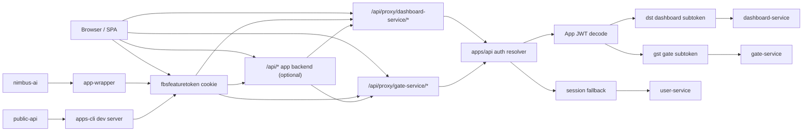
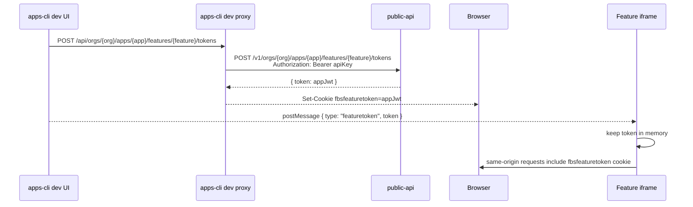
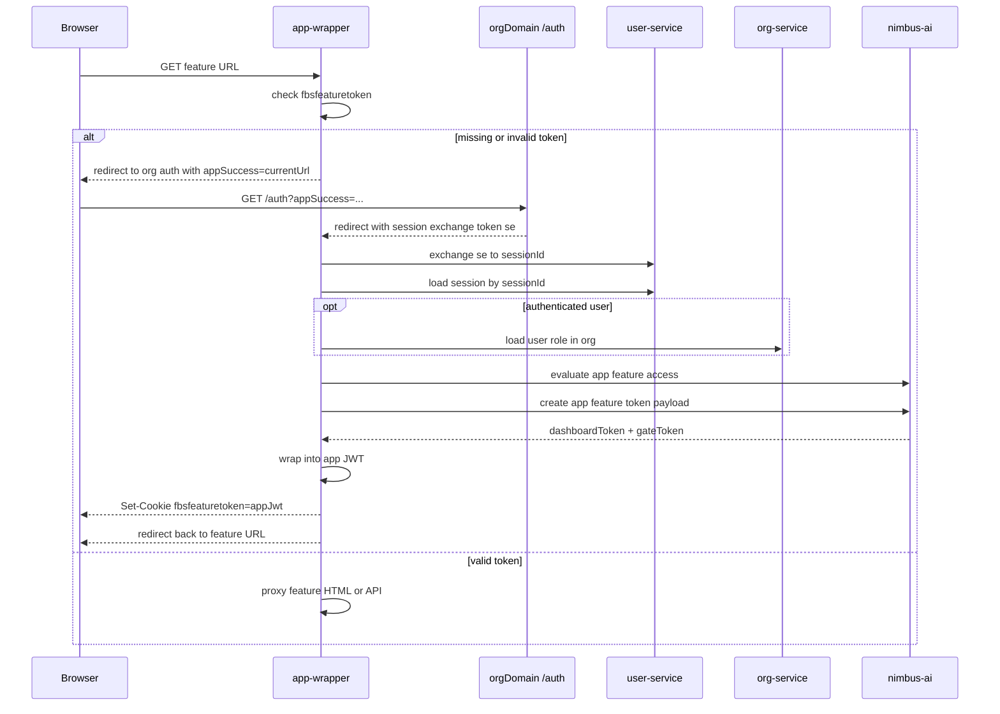
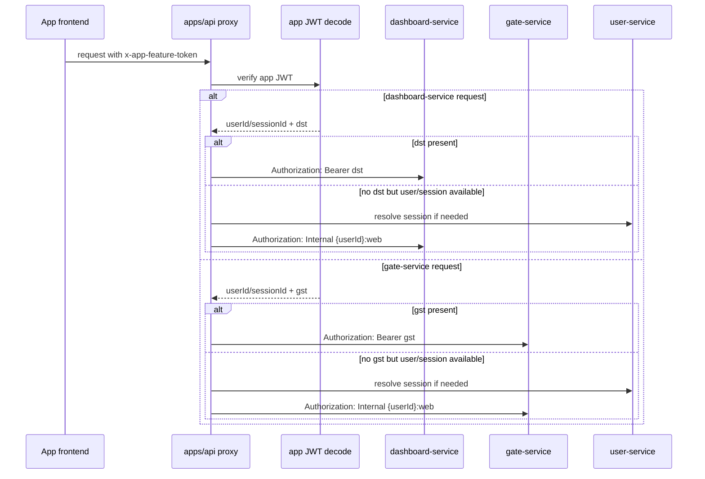
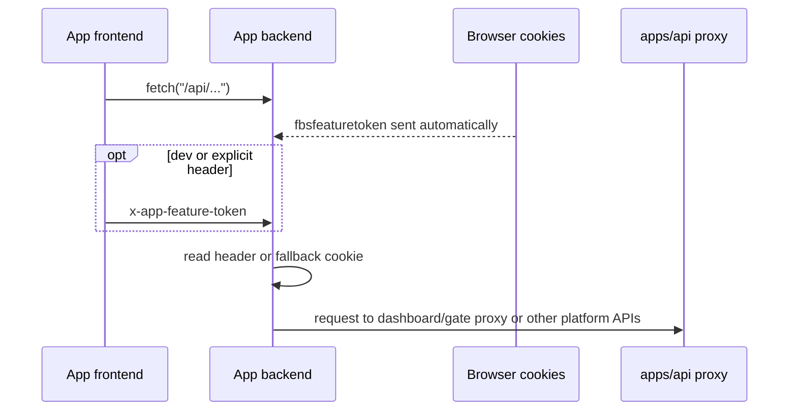
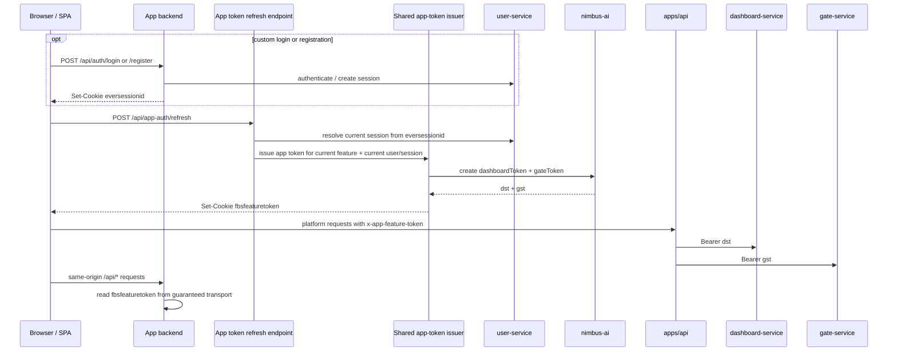

# App Authentication and Token Flow

This document describes the current authentication and token flow for apps created with `apps-cli`.

It covers:

- local development flow through `fusebase dev start`
- deployed runtime flow through `app-wrapper`
- how the frontend, app backend, `apps/api`, `public-api`, and `nimbus-ai` participate
- how `dashboardToken` and `gateToken` are produced and wrapped into the app JWT
- how app tokens and user sessions are read, refreshed, and updated while the app is in use
- current problems in the design
- a proposal for simplifying the flow

## Scope

This document focuses on the auth and token contract around apps and app features.

## Actors

- `apps-cli`
  - local development server
  - local iframe token delivery
- generated app frontend
  - SPA running in the browser
- generated app backend
  - optional feature-local backend at `/api/*`
- `app-wrapper`
  - deployed feature entrypoint and HTML/API proxy
- `apps/api`
  - same-origin platform proxy to internal services such as dashboard-service and gate-service
- `public-api`
  - API-key authenticated platform API used by CLI/dev flows
- `nimbus-ai`
  - feature access evaluation and runtime subtoken issuance
- `user-service`
  - session resolution
- `org-service`
  - org role lookup during app-wrapper access evaluation
- `dashboard-service`
  - downstream dashboard/data service
- `gate-service`
  - downstream Gate service

## Tokens and Session Types

There are several different auth artifacts in play:

| Artifact | Transport | Main purpose | Typical reader |
| --- | --- | --- | --- |
| API key | `Authorization: Bearer <apiKey>` | CLI and developer auth | `public-api` |
| Session exchange token | query param `se` | bridge from org auth UI into app-wrapper auth | `app-wrapper` |
| User session id | cookie `eversessionid` or header `everhelper-session-id` | user session fallback and custom app auth | `apps/api`, app backends, app-wrapper localhost special case |
| App feature token | cookie `fbsfeaturetoken`, sometimes header `x-app-feature-token` | feature-scoped runtime auth | frontend, app backend, `apps/api` |
| Dashboard subtoken | encrypted inside app JWT as `dst` | bearer auth to dashboard-service | `apps/api` dashboard proxy |
| Gate subtoken | encrypted inside app JWT as `gst` | bearer auth to gate-service | `apps/api` gate proxy |

## Current Architecture

### High-level view

## Current Flow

### 1. Local development flow

Local dev is driven by `apps-cli`, not by `app-wrapper`.

Important current behavior:

- `apps-cli` fetches a ready-made app JWT from `public-api`
- dev tooling delivers it in two ways
  - `postMessage` to the iframe
  - cookie `fbsfeaturetoken` for same-origin backend requests
- the issuance is API-key authenticated, so local dev is anchored to developer identity rather than browser session state
- this is the flow used by `fusebase dev start`

### 2. Deployed bootstrap flow

In deployed mode, the token is minted by `app-wrapper` after access evaluation.

In deployed mode, `app-wrapper` does the following:

- resolves the current feature
- reads session from the session exchange flow
- evaluates principals and app access through `nimbus-ai`
- asks `nimbus-ai` to create:
  - `dashboardToken`
  - `gateToken`
- wraps both subtokens into the encrypted app JWT and stores it in `fbsfeaturetoken`

### 3. Runtime service call flow

Once the feature is running, the frontend usually uses the app token to talk to platform proxies.

The important detail is that `apps/api` does not forward the app JWT to downstream services.

Instead, it:

- decrypts the app JWT
- extracts:
  - user identity
  - optional session id
  - optional dashboard/gate bearer subtokens
- then forwards either:
  - `Bearer <dst>` or `Bearer <gst>`
  - or `Internal {userId}:web`

### 4. App backend flow

Apps generated through `apps-cli` may also have their own backend under `/api/*`.

Current best practice for app backends:

- do not rely on `x-app-feature-token` only
- deployed proxying may drop this custom header on the way to the app backend
- backend handlers should read:
  - `x-app-feature-token`
  - or fallback cookie `fbsfeaturetoken`

### 5. User session flow inside apps

User session and app feature token are related but not the same thing.

`eversessionid` represents the user session.

`fbsfeaturetoken` represents the feature runtime context.

This distinction matters a lot when apps add their own login or registration forms:

- a backend may successfully authenticate a user server-to-server
- but unless it explicitly sets a browser session cookie, the browser still has no user session
- even if a browser session exists, an already-issued `fbsfeaturetoken` may still represent a visitor

## What Is Inside the App JWT Today

There are currently two different app JWT shapes in use.

### A. Local development token from `public-api`

Current local dev token creation uses `public-api` and wraps only the basic app context:

- `appId`
- `orgId`
- `appFeatureId`
- optional `userId`
- optional `sessionId`

It does not add:

- `dashboardToken`
- `gateToken`
- `featureRowVersion`

In the current `apps-cli` dev path, this token is usually developer-authenticated through the API key and does not model the deployed browser session flow closely.

### B. Deployed token from `app-wrapper`

Current deployed token creation uses `nimbus-ai` plus app-wrapper wrapping:

- `appId`
- `orgId`
- `appFeatureId`
- optional `userId`
- optional `sessionId`
- `dashboardToken` stored as `dst`
- `gateToken` stored as `gst`
- `featureRowVersion` stored as `frv`

### Current consequence

Local dev and deployed runtime do not use the same app-token contract.

That is one of the biggest sources of confusion and drift.

## Reading and Updating Tokens During App Usage

### Reading

Frontend:

- local dev can receive the token via `postMessage`
- generated app guidance reads `fbsfeaturetoken` from cookie on startup
- direct SDK and platform proxy calls usually send it in `x-app-feature-token`

App backend:

- should read `x-app-feature-token`
- or fallback to `fbsfeaturetoken`

Platform proxy:

- reads `x-app-feature-token`
- falls back to `everhelper-session-id` or `eversessionid` when necessary

### Updating

`fbsfeaturetoken` is updated today in a few different ways:

- local dev:
  - `apps-cli` fetches a token when a feature is selected
  - HTML rewrite also sets `fbsfeaturetoken`
- deployed:
  - `app-wrapper` reissues the token when auth flow is re-entered
  - a stale token is also replaced when app-wrapper detects row-version mismatch

`eversessionid` is updated separately by auth/login flows and is not automatically tied to `fbsfeaturetoken`.

### Practical consequence

A user session can change without `fbsfeaturetoken` changing.

Examples:

- user logs in through a custom app form
- backend gets a valid `sessionId`
- backend stores `eversessionid`
- `fbsfeaturetoken` still contains the old visitor context

This means:

- app-level auth state may now be "logged in"
- direct SDK / Gate / dashboard proxy calls may still behave like a visitor flow until the app token is refreshed

## Current Problems

### 1. Dev and deployed token contracts diverge

Current state:

- local dev token comes from `public-api`
- deployed token comes from `app-wrapper` + `nimbus-ai`
- only deployed token carries `dst`, `gst`, and `frv`

Impact:

- bugs reproduce only in deployed mode
- Gate-specific issues are easy to miss locally
- token lifecycle behavior differs between environments
- public visitor and in-app login transitions are hard to reproduce faithfully in local dev

### 2. Feature token and user session are separate but look interchangeable

Current state:

- `fbsfeaturetoken` and `eversessionid` both influence auth
- generated apps often treat them as if they were the same thing

Impact:

- custom login flows are easy to implement incorrectly
- `/users/me` is misused as a session detector for visitor tokens
- "Session Expired" can appear even when the token is valid but anonymous

### 3. App backend token ingress is fragile

Current state:

- frontend often sends `x-app-feature-token`
- deployed platform proxy may not preserve that header on `/api/*`

Impact:

- app backend receives no feature token in deployed mode
- apps work in local dev and fail after deploy

### 4. No first-class app-token refresh contract

Current state:

- `fbsfeaturetoken` is refreshed mainly by re-entering app-wrapper auth flow
- custom in-app auth changes session state but not necessarily feature-token state

Impact:

- visitor-to-user transitions inside public features are awkward
- apps need ad-hoc reload or redirect logic
- frontend auth state and SDK auth state can diverge

### 5. `/users/me` is overloaded

Current state:

- `/users/me` is a user-authenticated endpoint
- public feature visitor tokens can still be valid even when `/users/me` returns 401

Impact:

- apps interpret anonymous visitor as expired auth
- login forms are hidden by the wrong modal or error state

### 6. Backward compatibility around `gateServiceToken` is subtle

Current state:

- old app tokens may not contain `gst`
- new gate proxy logic now rejects missing `gst` explicitly

Impact:

- older tokens can fail only on Gate flows
- behavior is clearer now, but still easy to misdiagnose without understanding token shape

### 7. Observability is weak

Current state:

- debugging often requires reading logs across multiple services
- there is no single documented way to inspect the effective auth state

Impact:

- incidents take longer to localize
- teams guess whether the problem is session, app token, subtoken, or proxy forwarding

## Recommended Global Simplification

### 1. Use one canonical app-token issuer contract

Target:

- local dev and deployed runtime should produce the same app JWT shape
- always include the same top-level fields when available:
  - app context
  - user/session context
  - `dst`
  - `gst`
  - `frv`

Recommended change:

- move local dev token issuance away from the simplified `public-api` app-token generator
- either:
  - have `public-api` dev token endpoint delegate to the same `nimbus-ai` subtoken issuance path used by deployed runtime
  - or extract a shared issuer used by both dev and deployed flows

This is the single highest-value simplification.

### 2. Introduce a first-class app-token refresh endpoint

Target:

- refresh `fbsfeaturetoken` from current session and current feature context without a full redirect dance

Recommended change:

- add a platform-managed refresh endpoint that:
  - resolves the current feature
  - reads current browser session
  - re-evaluates access
  - reissues `fbsfeaturetoken`

Benefits:

- clean visitor-to-user transition after in-app login
- no need for ad-hoc reload logic
- same behavior for frontend and app backend

### 3. Introduce a first-class "current user or null" app endpoint

Target:

- apps should not have to invent `/api/auth/me` from scratch

Recommended change:

- add a platform-level endpoint with this contract:
  - valid authenticated user -> `{ user: ... }`
  - anonymous visitor in public feature -> `{ user: null }`
  - expired or invalid app token -> explicit auth error

This removes the `/users/me` ambiguity for app authors.

### 4. Make app backend token ingress explicit and stable

Target:

- app backends should receive the feature token through one guaranteed contract

Recommended change:

- continue supporting cookie fallback
- additionally standardize one platform-owned transport for app backends, for example:
  - guaranteed forwarded header
  - or explicit runtime helper injected by platform contract

The important part is to stop making each generated app rediscover the same header-loss issue.

### 5. Standardize custom app auth on `eversessionid`

Target:

- if an app performs login or registration itself, it should integrate with the platform session model instead of inventing a parallel cookie

Recommended change:

- document and template the standard:
  - backend receives `sessionId`
  - backend sets browser cookie `eversessionid`
  - app-level auth reads session from `eversessionid`
  - app-token refresh is then handled via the first-class refresh endpoint

This removes one entire category of custom auth bugs.

### 6. Add safe token introspection for debugging

Target:

- make it obvious which auth layer is broken

Recommended change:

- add a debug or introspection view that reports metadata only:
  - app token present or absent
  - has `userId`
  - has `sessionId`
  - has `dst`
  - has `gst`
  - feature row version
  - session cookie present or absent

It should never expose the raw subtoken values.

## Recommended Target Model

The simplest stable mental model is:

1. User session answers: "Who is the browser user?"
2. App token answers: "What feature context is this runtime allowed to use?"
3. Dashboard and Gate subtokens answer: "What may this feature do in downstream services?"

And the target runtime contract becomes:

- one app-token shape in dev and deployed
- one standard session cookie
- one standard app-token refresh path
- one standard current-user-or-null path
- one standard app-backend token ingress path

## Summary

Today the system works, but it is split across:

- one dev-only token issuer contract
- one deployed token issuer contract
- separate feature token and user session lifecycles
- multiple implicit fallbacks

The biggest simplification is to unify app token issuance and refresh around one canonical platform contract.
