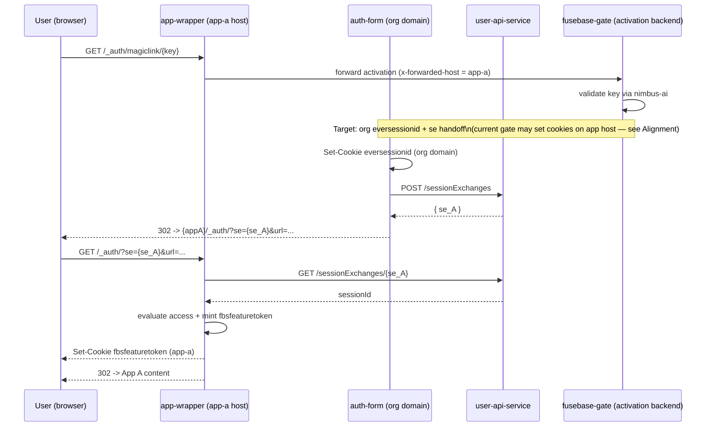
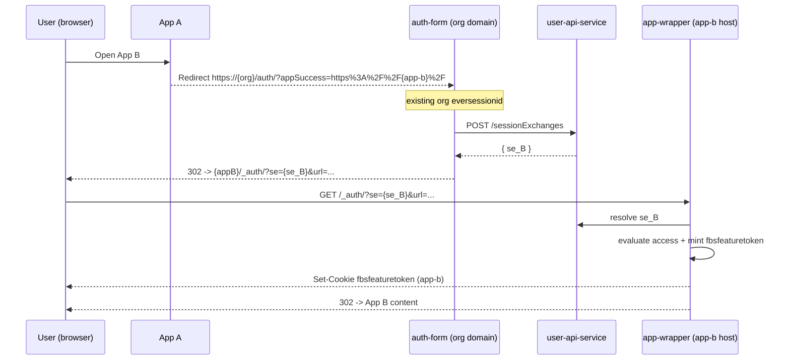
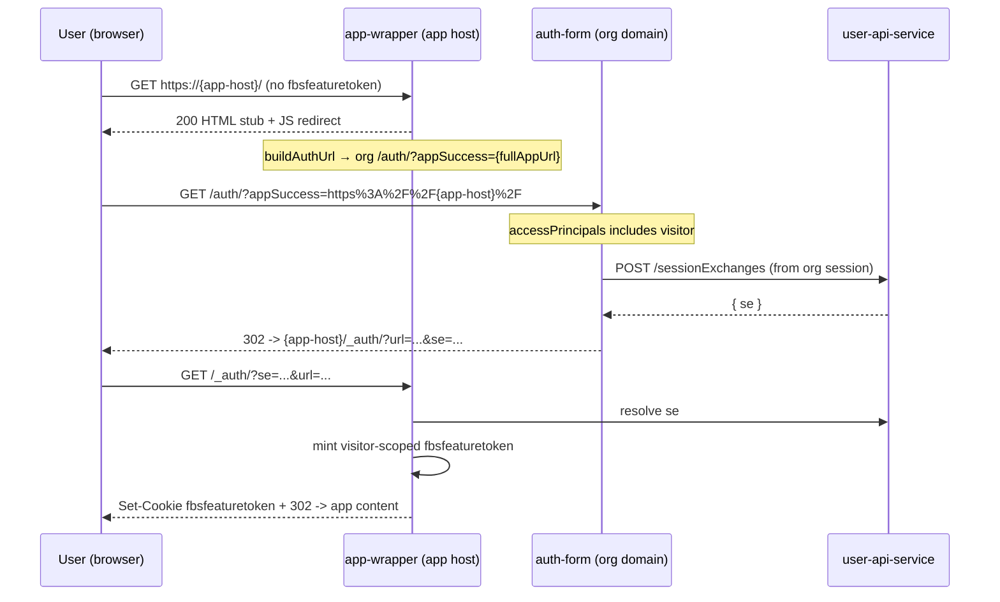

# App Authorization via `auth-form` + `sessionExchanges` (handoff)

## Summary
`auth-form` owns the org session (`eversessionid` on the org domain). For each app host, `app-wrapper` exchanges a short-lived `se` token (minted by `user-api-service`) for the `fbsfeaturetoken` cookie. After App A is activated, the user can open App B, App C, and so on via redirect/handoff through `auth-form` — **without generating a new magic link**.

**White label:** the magic-link URL in email must live on the **app domain** (`https://{app-host}/_auth/magiclink/{key}`), handled by `app-wrapper` — not on the org domain (`/link?id=...`).

**URL contract:** callers pass a **full app URL** in `appSuccess` (as `auth-form` does today). `auth-form` builds the internal `/_auth/?url=...&se=...` handoff URL itself.

**Public apps:** visitor-allowed apps still run the `se` → `fbsfeaturetoken` handoff on first visit, but skip the login screen when org session exists.

## Scope
This doc covers:
- First app entry (App A) after magic link / org auth.
- Subsequent app entries (App B, App C, …) via the same handoff pattern.
- Where `se` is exchanged into app auth (`fbsfeaturetoken`) and where `eversessionid` lives.
- White-label magic-link URL requirements.
- Public (visitor-allowed) app behavior on first load.

Not covered:
- The full app JWT contract (`dst`/`gst`) beyond what is required for the handoff.
- Custom app JWT token refresh endpoints.

## Actors
- **User (browser)**: follows redirects and sends cookies for the current host.
- **Auth-form** (org domain): login UI, org session (`eversessionid`), `se` mint, handoff orchestration.
- **Session exchange service** (`user-api-service`): `POST /sessionExchanges`, `GET /sessionExchanges/{token}`.
- **App-wrapper** (each app host): magic-link entrypoint, `/_auth/?url=...&se=...` handoff, access checks, `fbsfeaturetoken` mint.
- **Fusebase-gate** (today): platform magic-link activation backend proxied from app-wrapper (may be realigned to the org-session + `se` model below).

## URL contracts

### `appSuccess` (auth-form entry)
Callers must pass a **full app URL** with `http` or `https`. This matches current `auth-form` behavior (`AppHandler::handleAppSuccess`).

**Login / handoff entry (org domain):**
```
https://{org-domain}/auth/?appSuccess=https%3A%2F%2F{app-host}%2F
```

Examples:
- Managed app: `https://myorg.nimbusweb.me/auth/?appSuccess=https%3A%2F%2Fmy-app.thefusebase.app%2F`
- Custom CNAME app: `https://myorg.example.com/auth/?appSuccess=https%3A%2F%2Fapp.client.com%2F`

`auth-form` validates `appSuccess` host via `appsByHost`, then **internally** builds the app handoff target:
```
https://{app-host}/_auth/?url={encodedPathAndQuery}&se={session_exchange_token}
```

Callers do **not** put `/_auth/?se=...` into `appSuccess` directly.

### Magic-link URL (email / invite)
**Target (white label):** magic links are issued on the **app host**:
```
GET https://{app-host}/_auth/magiclink/{key}
```

`app-wrapper` terminates every app domain (managed `*.thefusebase.app` and custom CNAME) and handles this path.

**Not the target for app magic links:** org-domain portal-style URLs such as:
```
GET https://{org-domain}/link?id={magicKey}&appSuccess=...
```
Those are org-branded and do not meet white-label requirements for app invites.

## Tokens and cookies
| Artifact | Name in flows | Transport | Who sets/reads | Purpose |
| --- | --- | --- | --- | --- |
| Org login/session | `eversessionid` | org-domain cookie | Set: auth-form; read: auth-form, web client | Org session |
| Session exchange token | `se` | query param `se` | Mint: user-api-service; read: app-wrapper | Short-lived bridge for redirect hops |
| App runtime context token | `fbsfeaturetoken` | cookie | Set-Cookie: app-wrapper on app host | App API auth on that app host |

### Key invariants
- App-host access is derived from `fbsfeaturetoken` minted from `se`.
- `eversessionid` is owned by `auth-form` and lives on the org domain.
- `se` can be resolved multiple times within its TTL (Redis key is not deleted on resolve).
- Access checks (permissions / orgRole mapping) happen in `app-wrapper` before `fbsfeaturetoken` is minted.

## Flow 1: Magic link → App A (white label)

Magic-link emails point at the **app domain**. Activation establishes the org session, then hands off to the app host for `fbsfeaturetoken`.



### Cookie placement for App A
- `eversessionid` — org domain (`auth-form`).
- `fbsfeaturetoken` — app host (`app-wrapper` via `/_auth/?url=...&se=...`).

## Flow 2: App A → App B (2nd app entry)

No new magic link. App B uses the existing org session and an `auth-form` handoff.



If the user lands on App B directly without `fbsfeaturetoken`, `app-wrapper` redirects to:
```
https://{org-domain}/auth/?appSuccess=https%3A%2F%2F{app-b-host}%2F{path}
```
(same handoff pattern; no new magic-link activation step when org session exists and permissions allow).

## Flow 3: App B → App C → ... (N apps)
Same as Flow 2: org `eversessionid` + fresh `se` per app host + `fbsfeaturetoken` on each app host.

## Public (visitor-allowed) apps

A **public app** is an app whose `accessPrincipals` include `{ type: "visitor" }`. Such apps allow anonymous access at the product level, but the platform still mints a runtime token on the app host.

### What “public” does and does not mean

| | Public app | Private app |
| --- | --- | --- |
| Login screen on first visit | **No** (when visitor is allowed and handoff succeeds) | **Yes** (unless org session already exists) |
| Redirect/handoff on first visit | **Yes** — until `fbsfeaturetoken` is set | **Yes** |
| `fbsfeaturetoken` required for HTML/API | **Yes** | **Yes** |
| Org `eversessionid` required for visitor fast-path | **Yes** — `auth-form` mints `se` from an existing session | N/A (user must authenticate) |

**Important:** public access does **not** mean “open the app URL with no redirects”. It means the handoff chain runs **without showing the login form** when `auth-form` can mint `se` immediately.

### First visit (no `fbsfeaturetoken`)



**Why JS redirect, not 302?** On the first cookie-less hit, `app-proxy` returns a `200` HTML stub with a client-side redirect to `auth-form` (not a bare `302`). This avoids infinite redirect loops for link-preview crawlers (iframely, Slackbot, etc.) while still sending real browsers through auth.

**Code paths (current):**
- `nx-frontend/apps/app-wrapper/src/routes/app-proxy.ts` — `authResult === 'no-token'` → `buildBotOgHtml(..., redirectUrl: buildAuthUrl(...))`
- `auth-form/include/apphandler.php` — `visitorAllowed` → immediate `POST /sessionExchanges` + `Location: {app}/_auth/?...&se=...`
- `nx-frontend/apps/app-wrapper/src/routes/auth.ts` — resolves `se`, evaluates access (includes `Visitor` principal), mints `fbsfeaturetoken`

### Repeat visit
If `fbsfeaturetoken` is already present and valid on the app host, `app-proxy` serves content directly — **no redirect**.

### Static assets and webhooks
These paths **bypass** `fbsfeaturetoken` checks in `app-proxy`:
- Static files (`.js`, `.css`, images, fonts, etc.)
- `/api/webhooks/*` (authenticated by secret path segment)

### Edge cases

| Case | Behavior |
| --- | --- |
| Public app, **no org session** (`eversessionid`) | User must authenticate via `auth-form` (login or magic link) before visitor fast-path can mint `se`. |
| Public app, stale/invalid `fbsfeaturetoken` | `app-proxy` clears cookie and redirects to `auth-form` (302, not JS stub). |
| Public managed app without `roid` | `auth.ts` may block or resolve `runOrgId` depending on product type; visitor path still applies when configured. |
| Opening public App B from App A | Same handoff as private apps (Flow 2); visitor fast-path applies if App B allows visitor. |

### Acceptance (public apps)
- First UI load completes without a login screen when the app allows visitor and org session exists.
- A redirect/handoff still occurs on the first visit until `fbsfeaturetoken` is minted.
- Repeat visits do not re-trigger auth when `fbsfeaturetoken` is valid.

## Web client (`.thefusebase.com` / CNAME)
The web client authenticates via `eversessionid` only — no `se` or `fbsfeaturetoken`.

- **CNAME org**: web client on the same host (`{org}/space`), host-only org cookie.
- **`.thefusebase.com` ecosystem**: `Domain=.thefusebase.com` covers org subdomains and `app.thefusebase.com`.

## White label

White-label apps use a **custom app domain** (CNAME). Product requirements:

| Requirement | Rationale |
| --- | --- |
| Magic-link URL is on the **app domain** | Email links must show the customer's brand (`app.client.com`), not the org domain (`myorg.nimbusweb.me/link?...`). |
| `app-wrapper` terminates `/_auth/magiclink/:key` | Same code path for managed and CNAME hosts; ingress rules cannot shadow `/_auth/`. |
| Org auth stays on the **org domain** | `eversessionid` and login UI remain on `{org-domain}/auth/`. |
| `appSuccess` carries the **full app URL** | Matches `auth-form` validation; internal `/_auth/?se=...` is built server-side. |
| App runtime auth via **`fbsfeaturetoken` on app host** | Cross-host cookie sharing is not used; each app host gets its own token via `se`. |

**Email template:** `magic_link_app` should emit:
```
https://{registered-app-host}/_auth/magiclink/{key}
```
(not `{org-domain}/link?id=...`).

**CNAME note:** org cookie (`eversessionid`) and app cookie (`fbsfeaturetoken`) are on different registrable domains. Handoff always goes through `auth-form` on the org domain + `se` exchange on the app host — never via a shared parent-domain cookie.

## Implementation alignment (current vs target)

| Area | Current code | Target per this spec |
| --- | --- | --- |
| Magic-link URL | `https://{app-host}/_auth/magiclink/{key}` via app-wrapper → gate | Keep app-domain URL (white label) |
| Magic-link activation cookies | `fusebase-gate` sets host-only `eversessionid` + `fbsfeaturetoken` on app host | **Realign:** org `eversessionid` via `auth-form`, app `fbsfeaturetoken` via `se` handoff |
| `appSuccess` format | Full app URL (already) | Documented above; no caller-built `/_auth/` |
| App-to-app navigation | `buildAuthUrl()` → org `/auth/?appSuccess={fullAppUrl}` | Same |
| Public apps | JS redirect + visitor fast-path in `AppHandler` | Documented above; unchanged |

## Acceptance criteria
- Magic-link emails contain `https://{app-host}/_auth/magiclink/{key}` (app domain, white label).
- Magic-link activation results in org `eversessionid` and app-host `fbsfeaturetoken` (via `se` exchange on `/_auth/`).
- `appSuccess` in auth-form uses a full app URL; auth-form builds `/_auth/?url=...&se=...` internally.
- Opening App B from App A uses org `/auth/?appSuccess={fullAppBUrl}` handoff (no new magic-link activation). With permissions, App B UI loads after the exchange.
- Public apps: first visit performs handoff without a login screen when visitor is allowed; redirect still occurs until `fbsfeaturetoken` is set.
- Web client loads from org `eversessionid` without `se` or `fbsfeaturetoken` (UI only).
