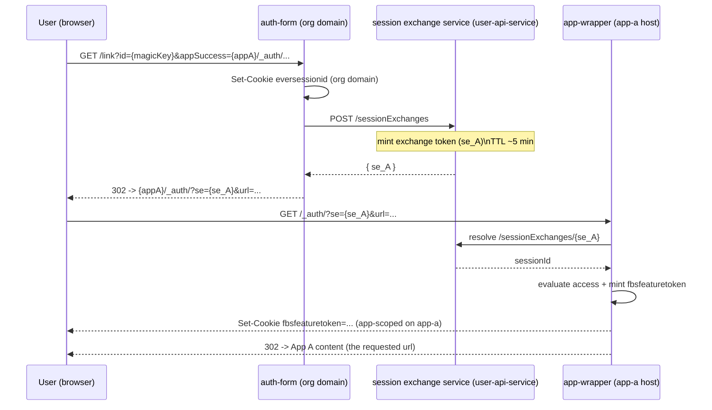
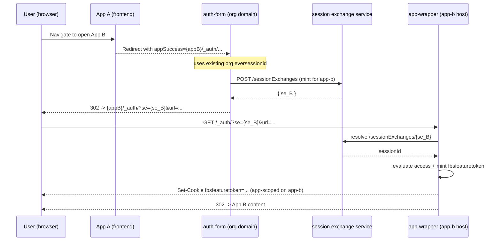
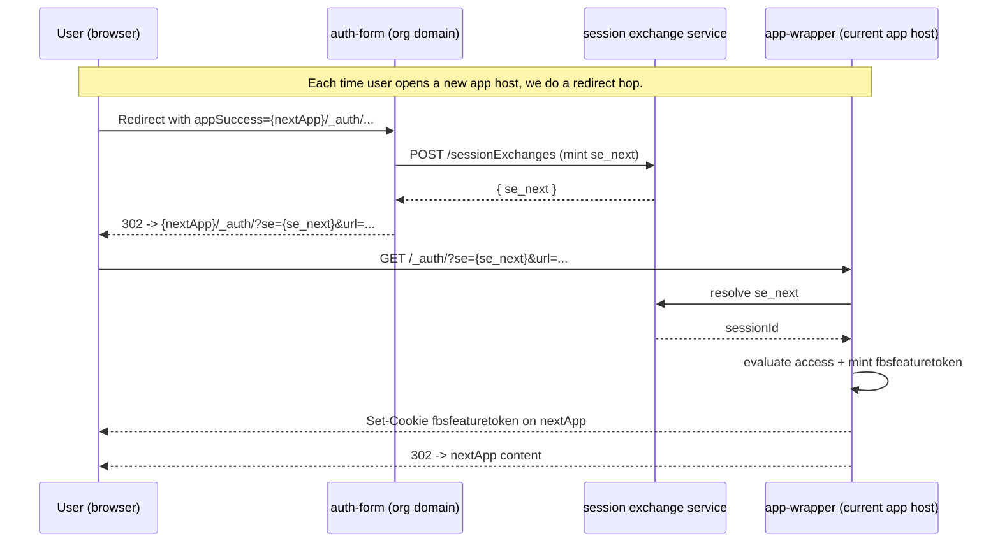

# App Authorization via `auth-form` + `sessionExchanges` (handoff)

## Summary
In short: `auth-form` mints a short-lived exchange token `se` from the existing org session (via `user-api-service`), and on each app host `app-wrapper` exchanges `se` for the `fbsfeaturetoken` cookie. After a magic link activates App A, the user can open App B, App C, and so on without re-activating a magic link and without app-level credentials.

## Scope
This doc covers:
- First app entry (App A) after magic link / org auth.
- Subsequent app entries (App B, App C, …) via the same handoff pattern.
- Where `se` is exchanged into app auth (`fbsfeaturetoken`) and where `eversessionid` lives.
- The target end-to-end flow (no open-questions section).

Not covered:
- The full app JWT contract (`dst`/`gst`) beyond what is required for the handoff.
- Custom app JWT token refresh endpoints (unless they are needed to implement the handoff).

## Actors
- **User (browser)**: follows redirects and automatically sends cookies for the current host.
- **Auth-form**: org-domain auth service (login, magic link activation UI/service).
- **Session exchange service** (`user-api-service`):
  - mints exchange tokens via `POST /sessionExchanges`
  - resolves exchange tokens by token lookup (`GET /sessionExchanges/{token}` or equivalent)
- **App-wrapper on the app host** (`nx-frontend app-wrapper` on `app-a.*`, `app-b.*`, …):
  - accepts exchange token as query param on `/_auth/?url=...&se=...`
  - resolves token, evaluates app access, and mints **`fbsfeaturetoken`** (app-scoped) for subsequent app API calls

## Tokens and cookies
| Artifact | Name in flows | Transport | Who sets/reads | Purpose |
| --- | --- | --- | --- | --- |
| Org login/session | `eversessionid` | org-domain cookie | Set: auth-form; read: auth-form, web client | Org session; proves the user is authenticated in org context |
| Session exchange token | `se` | query param `se` | Mint: user-api-service; read: app-wrapper | Short-lived bridge token used only for redirect hops |
| App runtime context token | `fbsfeaturetoken` | cookie | Set-Cookie: app-wrapper on app host | App API auth on that app host |

### Key invariants
- App-host access is derived from `fbsfeaturetoken` minted from `se`.
- `eversessionid` is owned by `auth-form` and lives on the org domain.
- `se` can be resolved multiple times within its TTL (the Redis key is not deleted on resolve; it expires by TTL).
- Access checks (permissions / orgRole mapping) happen in `app-wrapper` before `fbsfeaturetoken` is minted.

## Flow 1: Magic link / org auth → App A

### Where `fbsfeaturetoken` / `eversessionid` are stored for App A
- `eversessionid` is established by `auth-form` on the **org domain**.
- `fbsfeaturetoken` is minted by **app-wrapper on the `app-a` host** (via `/_auth/?url=...&se=...`).

## Flow 2: App A → App B (2nd app entry)

App A does not “reuse” `eversessionid` cross-host. Instead, opening App B triggers an auth-form handoff (redirect hop, **without a new magic-link activation step**). `auth-form` mints a fresh exchange token (`se_B`), and app-wrapper on the target host mints `fbsfeaturetoken`.

If the user lands on App B directly (no `fbsfeaturetoken` yet), app-wrapper redirects to `auth-form` on the org domain with `appSuccess` pointing back to App B — the same handoff pattern applies.

### `fbsfeaturetoken` for App B
- Minted by **app-wrapper on the `app-b` host** during `/_auth/?url=...&se=...`.

## Flow 3: App B → App C → App D → ... (N apps)
The pattern is the same and composes:

## Web client (`.thefusebase.com` / CNAME)
The web client authenticates directly via the `eversessionid` cookie. If `auth-form` set `eversessionid` on the org domain and the cookie scope includes the web client host, login happens automatically. The web client does **not** require `se` exchange or `fbsfeaturetoken`.

- **CNAME org**: web client on the same host (`{org}/space`), host-only cookie on the org domain.
- **`.thefusebase.com` ecosystem**: cookie `Domain=.thefusebase.com` covers both org subdomains and `app.thefusebase.com`.

## Acceptance criteria
- Magic link (org auth) activates App A and results in `fbsfeaturetoken` being minted on the App A app host by app-wrapper (after `se` exchange).
- Opening App B from App A goes through a redirect/handoff to `auth-form` (no new magic-link activation step). If the user has permissions, App B loads protected content immediately after the exchange.
- `eversessionid` remains an org-domain cookie set by `auth-form` (not a substitute for `fbsfeaturetoken` on app API calls).
- The web client loads without extra auth when `eversessionid` is visible on the web client host cookie scope (UI only).
